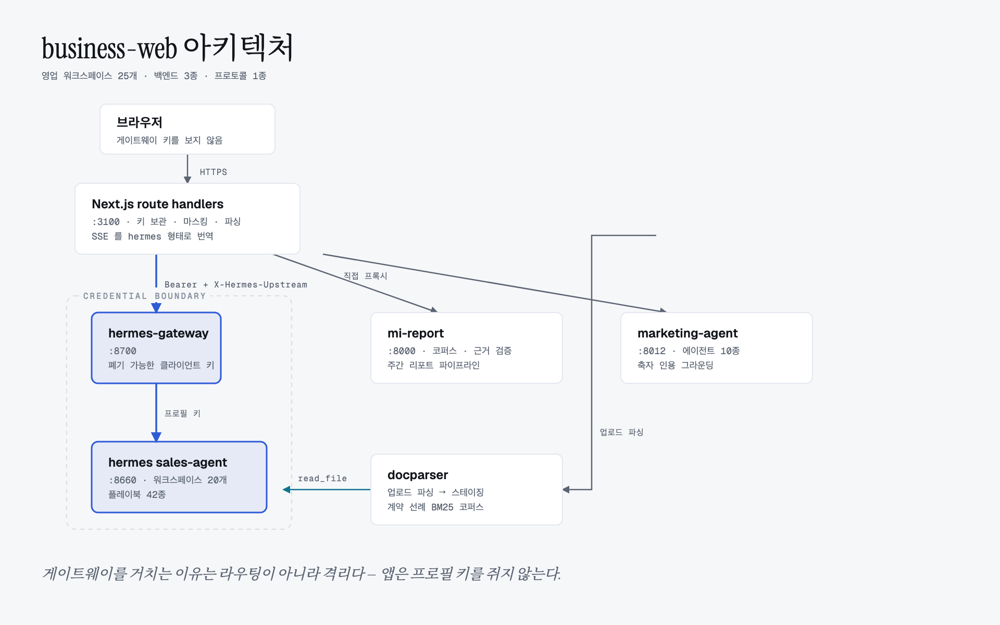

# business-web

영업팀용 agent 웹 서비스. 워크스페이스 23개를 **영업팀의 업무 영역 7개**로 묶습니다.

| 업무 영역 | 워크스페이스 | 담당 플레이북 |
|---|---|---|
| **시장·고객 조사** | MI 리포트 | `mi-report` FastAPI (`:8000`) — 코퍼스 Q&A + 주간 리포트 |
| | 시황·시장규모 | `market-trend-brief`, `market-sizing` |
| | 고객사 브리핑 | `account-brief` |
| **판매전략** | 목표·판매계획 | `sales-target-setting`, `sales-plan` |
| | 판매 실행관리 | `sales-execution-tracking` |
| | 가격·마크업 | `pricing-strategy`, `markup-policy` |
| | 판매회의·업무보고 | `sales-meeting-report` |
| | 영업 현황진단 | `marketing-agent` (`:8012`) — 10개 에이전트 · 축자 인용 그라운딩 |
| **신규수요 창출** | 신규수요 발굴 | `demand-generation`, `territory-prospecting` |
| | Design-win·샘플 | `design-win-management`, `competitive-conversion`, `sample-management` |
| | 판촉·딜등록 | `promotion-program`, `sales-code-registration` |
| **딜 진행** | 미팅 정리 | `discovery-notes`, `followup-email`, `deal-qualification` |
| | 제안서 | `proposal-outline` |
| | 경쟁·반론 대응 | `competitive-battlecard`, `objection-handling` |
| | 딜·파이프라인 | `deal-risk-review`, `pipeline-hygiene` |
| **계약** | 계약서 분석 | hermes `contract-review` (`:8659`) — 전용 SOUL.md |
| | 계약 운영 | `contract-operations` |
| **물량·품질 운영** | 물량·재고 운용 | `supply-allocation`, `inventory-management`, `strategic-volume-ops` |
| | 출하·물류 | `logistics-support` |
| | 클레임·EOL·PCN | `rma-handling`, `eol-management`, `pcn-management` |
| **고객 관리** | 고객 프로파일·내방 | `customer-profile`, `customer-visit-hosting`, `business-courtesy` |
| | 분기 리뷰 (QBR) | `qbr-review` |
| | MNC·해외법인 | `global-account-management`, `overseas-operations` |

표시가 없는 워크스페이스는 전부 hermes `sales-agent` 프로필(`:8660`) 위에서 돕니다.
`customer-data-handling` 스킬은 그 프로필의 모든 작업에 항상 적용되므로 어느
워크스페이스에도 배정하지 않습니다.

### 왜 이 구성인가

이 팀은 신규 수주만 하는 팀이 아니라 **부품 유통·제조 영업팀**입니다. 딜을 따는 일
옆에 판매계획과 목표 배분, 물량 배분과 재고, 마크업과 특가, Design-win 추적,
단종(EOL)·제품변경(PCN)·클레임(RMA) 대응, 주간 판매회의 보고가 같은 비중으로 있습니다.

이전 구성은 워크스페이스 7개를 일반 B2B 퍼널(조사 → 영업 실행 → 계약 → 관리)로
묶었고, `sales-agent` 프로필에 시드된 플레이북 40개 중 **8개에만** 도달했습니다.
나머지 32개는 설치돼 있는데 웹에서 부를 길이 없었습니다 — 딜 단계로 만든 네비게이션에는
재고 운용이나 PCN 대응을 놓을 자리가 애초에 없기 때문입니다. 그래서 지금은 딜 단계가
아니라 **업무 영역**으로 묶습니다.

이 매핑이 조용히 깨지는 것을 막는 장치가 `src/lib/playbooks.ts`입니다. 없는 플레이북
이름을 불러도 런타임 오류가 나지 않고 에이전트가 페르소나로 답해버려서 — 버그가 아니라
그냥 답이 나빠진 것처럼 보입니다. 그래서 이름을 한 곳에 모아 두고 `agents.test.ts`가
양방향으로 검증합니다: 워크스페이스가 부르는 이름이 전부 명세에 있는지, 명세의
플레이북이 전부 어느 워크스페이스에서든 도달 가능한지.

워크스페이스 대부분은 **하나의 hermes 프로필(`sales-agent`)** 위에서 돕니다.
스킬·메모리·모델 설정을 한 곳에 두기 위해서이고, 각 워크스페이스가 자기 플레이북을
쓰도록 만드는 것은 `agents.ts`의 `instructions` 필드입니다 — hermes가 이를 run 단위
임시 시스템 프롬프트로 받습니다.

### 화면

읽는 사람 대부분이 비개발자라, 진입점은 **홈 보드**(`/`)입니다 — 업무 영역 7개와
워크스페이스 23개를 각각 한 문장 설명과 실제 질문 예시와 함께 펼쳐 놓습니다.
이전에는 `/`가 첫 워크스페이스로 리다이렉트해서, 앱이 무엇을 할 수 있는지 알 방법이
없었습니다. 영역마다 색과 아이콘이 하나씩 있고 홈·사이드바·헤더에서 동일하게 쓰이므로
(`src/lib/stage-meta.ts`), 목록을 읽지 않고 모양으로 찾아갈 수 있습니다. 사이드바 23개
항목은 영역별로 접히며, 지금 있는 영역은 항상 펼쳐집니다.

## 오케스트레이션을 이 앱에 두지 않는 이유

에이전트 프레임워크(LangGraph 등)를 쓰지 않습니다. hermes api_server가 이미
오케스트레이터입니다:

| 보통 그래프로 짜는 것 | hermes가 이미 제공하는 것 |
|---|---|
| 툴 호출 루프 | 에이전트 내부 툴/스킬/서브에이전트 |
| human-in-the-loop 인터럽트 | `approval.request` + `POST /v1/runs/{id}/approval` |
| 스트리밍·중간 상태 | `GET /v1/runs/{id}/events` (SSE) |
| 대화 상태 | `conversation_history` / `session_id` |
| 취소 | `POST /v1/runs/{id}/stop` |

MI와 영업 현황진단도 같은 이유로 재구현하지 않습니다.

- `mi-report`는 코퍼스 인제스트(Confluence, SEC EDGAR, DART, 한경, 뉴스),
  하이브리드 검색, 근거 검증, LLM Wiki를 이미 갖고 있습니다 — 질문은
  `/agent/chat/stream`, 주간 리포트 작성은 `/report/generate/stream` + `/report/render`.
- `marketing-agent`는 실적 자료를 채널별 진단·지표·전략 3축·Action Items로
  바꾸는 10개 에이전트 하네스입니다. 축자 인용 그라운딩과 판단 보류 표기까지
  들어 있어 다시 만들면 반드시 더 나빠집니다 — `POST /sources` → `/pipeline/run`.

## hermes 프로필을 하나만 쓰는 이유

계약서 분석은 한때 전용 프로필(`contract-review`, `:8659`)을 따로 썼습니다. 워크스페이스
하나를 위해 프로세스·포트·자격증명이 하나씩 더 필요했고, 그 프로필의 SOUL.md 는 공유
번들의 `contract-review` 플레이북과 거의 같은 말을 하고 있었습니다 — 둘이 독립적으로
같은 규율에 수렴했습니다. 같은 계약서로 양쪽을 돌려 결과가 동등한 것을 확인하고
프로필을 내렸습니다.

워크스페이스별 차이는 프로필이 아니라 `agents.ts` 의 `instructions` 가 만듭니다.
hermes 가 이를 run 단위 임시 시스템 프롬프트로 받으므로, 새 워크스페이스를 추가할 때
프로필을 새로 띄울 이유는 **모델이나 툴셋이 실제로 달라야 할 때뿐**입니다.

(프로필 디렉터리 `~/.hermes/profiles/contract-review` 는 지우지 않고 남겨 뒀습니다.
게이트웨이 등록만 해제된 상태입니다.)

## 모델을 고르는 기준

`sales-agent` 프로필은 `z-ai/glm-5.3-flash` 로 돕니다. 그 전에는
`deepseek/deepseek-v4-flash-0731` 이었고, 바꾼 이유는 취향이 아니라 관측된 결함입니다.

긴 한국어 생성에서 디코더가 이탈했습니다. `공급계약서_한빛_불리.docx` 전면 검토가
요약 한가운데서 이렇게 깨졌습니다:

```
이 초안은 책임 상한 없음(무한 책임), 배경 권리 양도, 일방 해지로
구성돼 것이 아니라 구조젹으로 을 귀 귀 귀 귀 귀 귀 … 귀귀 귀귀.
```

한글로 멀쩡히 읽히는 치환도 함께 나왔습니다 — `반돋시`(반드시), `구조젹`(구조적),
`강당합니다`(감당합니다) — 그리고 한자와 키릴 문자까지 섞였습니다(`있忌`, `об향적`).

**더 위험한 쪽은 눈에 띄게 깨진 답변이 아닙니다.** 다른 실행은 6개 조항 중 3개에서
멈춘 뒤 말끔한 마무리 문단을 붙였습니다. 읽으면 완성된 검토서로 보이고, 빠진 세
조항을 알아채려면 원본과 대조하는 수밖에 없습니다.

측정해 보면 길이에 따라 갈립니다. 2,000~2,800자 짜리 짧은 답변은 네 번 모두
정상이었고, 손상은 전면 검토 같은 긴 생성에서만 나왔습니다. 즉 **가장 중요한
작업에서만 나타나는 결함**입니다.

프롬프트로 고칠 수 있는 문제가 아닙니다(SOUL 의 한자 금지 규칙은 이미 있었고,
디코더 이탈은 지시를 따르고 말고의 영역이 아닙니다). 그래서 두 가지를 함께 했습니다:
모델을 바꾸고, `src/lib/answer-quality.ts` · `source-check.ts` · `answer-review.ts`
세 층의 검수를 답변마다 돌립니다. 모델을 바꿔도 검수는 남습니다 — 어떤 모델을 쓰든
이 실패 양식이 사라졌다고 증명할 방법은 없고, 계약서 검토는 틀린 채로 넘어가면
안 되는 문서이기 때문입니다.

## 세 백엔드, 하나의 프로토콜

셋의 인터페이스가 전부 다릅니다:

| 백엔드 | 인터페이스 |
|---|---|
| hermes | SSE `{"event": "message.delta" \| "tool.started" \| "run.completed" …}` |
| mi-report | SSE `{"type": "delta" \| "progress" \| "done" \| "error"}` |
| marketing-agent | **SSE 없음** — `/pipeline/run`이 블로킹 POST로 구조화된 리포트 반환 |

서버에서 전부 hermes 형태로 번역합니다 (`src/lib/mi-report.ts`,
`src/lib/marketing-agent.ts`). 브라우저는 어휘 하나만 알면 되고,
`useRun`·`run-events.ts`는 백엔드를 구분하지 않습니다.

marketing-agent는 SSE가 없어 UI가 수 분간 죽어 보이므로, 어댑터가 단계마다
진행 프레임을 직접 냅니다 — 실제로 일어나는 일을 정직하게 표시하되, 에이전트가
스트리밍해 준 것은 아닙니다.

## 반드시 알아야 할 것 세 가지

**1. run의 모든 요청에 `X-Hermes-Upstream`이 필요합니다.**
게이트웨이는 요청마다 업스트림을 새로 고릅니다(헤더 > 모델 별칭 > 모델 접두사 >
기본값). `contract-review`에서 시작한 run의 이벤트 스트림을 헤더 없이 요청하면 기본
업스트림으로 가고, 그쪽은 그 `run_id`를 몰라 404 `run_not_found`를 냅니다.
라이브 게이트웨이에서 재현 확인했습니다. `src/lib/hermes.ts`가 강제합니다.

**2. 파일 업로드는 경로 전달 방식이고, 파싱은 업로드 시점에 합니다.**
hermes `/v1/runs`는 `file`/`input_file` 파트를 거부합니다 — 텍스트와 이미지만 받습니다.
대신 에이전트가 `read_file` 툴로 디스크를 읽을 수 있으므로, 업로드는
`~/.hermes/business-web-staging/<session>/`에 쓰고 그 절대경로를 프롬프트에
적어 넘깁니다. **웹 서버와 hermes 에이전트가 같은 파일시스템을 공유해야 동작합니다.**

`.docx`·`.pptx`·`.html` 은 업로드 시점에 `~/gitspace/docparser` 로 Markdown 으로
변환하고, `.docx` 는 표를 JSON 으로 따로 뽑아 함께 넘깁니다 (`src/lib/docparse.ts`).
**에이전트 툴이 아니라 여기서 파싱하는 이유**는 이 배포판이 사내 hardened hermes
("a2g/dtgpt only, **no MCP**")라 docparser 의 MCP 툴이 에이전트에 닿지 않기
때문입니다 — 프로필 `config.yaml` 에 `mcp_servers.docparser` 가 있어도 무시됩니다.
결과적으로 파싱이 결정적이고, 대화 열 턴에 한 번만 돌며, 계약서의 단가표·수량
약정 같은 표가 구조를 유지한 채 전달됩니다.

변환에 실패하면 원본 경로를 그대로 넘기고 UI 에 "원본 전달"로 표시합니다 —
업로드 자체는 절대 실패시키지 않습니다.

### 계약 선례 코퍼스

계약서 하나만 보면 "이 조항이 나쁜가"까지만 답할 수 있습니다. 협상을 실제로 가르는
질문 — 우리 표준과 무엇이 다른가, 지난 계약에서 이 조항을 어떻게 합의했는가 — 은
여러 계약서가 동시에 있어야 답이 됩니다.

계약 워크스페이스에서 첨부 칩의 **"선례로 추가"** 를 누르면 그 계약서가
`~/.hermes/business-web-corpus/` 에 색인됩니다(BM25 + 지식그래프). 이후 계약
워크스페이스의 모든 질문은 서버에서 코퍼스를 먼저 검색해 관련 선례를 프롬프트에
함께 실어 보냅니다 — 에이전트가 검색을 "선택"하는 데 기대지 않고, 인용 출처가
문서명으로 정확합니다.

**추가는 수동입니다.** 담당자가 열어본 모든 초안이 자동으로 "우리 선례"가 되면
코퍼스가 의미를 잃습니다.

**인덱스는 docparser 것과 분리합니다.** docparser 기본 인덱스에는 하드웨어
데이터시트가 들어 있고, BM25 는 청크가 어느 코퍼스 소속인지 모릅니다. 섞으면
"지연배상" 검색이 핀아웃 표와 경쟁합니다 (`DATA_DIR`/`GRAPHIFY_OUT` 로 분리).

**3. mi-report의 세션 ID를 직접 만들면 안 됩니다.**
mi-report는 자기 세션 ID(`mi-agent-<hex>`)를 발급하고 소유권을 검증합니다. 이 앱의
세션 ID를 그대로 넘기면 에이전트가 돌기도 전에 404입니다. 첫 턴은 세션 ID 없이
보내고, `done` 프레임이 돌려준 ID를 기억해 다음 턴에 씁니다 (`src/lib/mi-sessions.ts`).

## 실행

프로필은 `~/.hermes` 에 살고 git 밖이라, **레포만 클론해서는 앱이 동작하지 않습니다.**
프로필이 없으면 워크스페이스는 백엔드 없음으로, 플레이북이 없으면 "정상"으로 보이면서
답변 품질만 조용히 떨어집니다. 그래서 셋업을 스크립트로 남겨 뒀습니다.

```sh
./scripts/setup-hermes-profile.sh          # dry-run — 무엇을 할지 먼저 확인
./scripts/setup-hermes-profile.sh --apply  # sales-agent 프로필 생성·SOUL.md·플레이북 40종

cp .env.example .env.local     # HERMES_GATEWAY_KEY 채우기
chmod 600 .env.local
npm install
npm run dev                    # http://localhost:3100
```

스크립트는 멱등이고, 마지막에 **앱이 이름으로 부르는 플레이북이 실제로 깔렸는지**
검증한 뒤 하나라도 없으면 종료 코드 1로 멈춥니다(`src/lib/playbooks.ts` 대조).
`profiles/sales-agent/SOUL.md` 가 원본이므로 프로필 쪽을 직접 고치면 다음 실행에서
덮입니다.

### 의존 서비스 — launchd

서비스 5종(웹 · hermes-gateway · sales-agent · mi-report · marketing-agent)은
launchd LaunchAgent 로 등록해 로그인 시 뜨게 해 두었습니다. 일상적으로는 이 스크립트
하나만 쓰면 됩니다.

```sh
./scripts/services.sh          # 상태
./scripts/services.sh start    # 내려간 것만 올린다
./scripts/services.sh restart  # 전부 재기동 (코드 변경 후)
./scripts/services.sh logs     # 최근 오류 로그
```

새 머신에서는 한 번만:

```sh
npm run build                                  # 웹은 빌드 산출물을 서빙한다
hermes -p sales-agent gateway install          # hermes 가 자기 서비스를 등록
./scripts/services.sh install                  # 나머지 넷
./scripts/services.sh start
```

**KeepAlive 자동 재시작은 이 머신에서 동작하지 않습니다.** 프로세스를 죽여 실측한
결과 launchd 가 죽음은 감지하지만(`state` 변경) 재시작을 시도하지 않습니다
(`runs` 카운터 그대로). hermes 가 자체 설치한 서비스도 같았으므로 이 레포의 plist
문제가 아니라 환경 조건입니다. 그래서 복구 수단은 `services.sh start` 이고,
스크립트가 `launchctl kickstart` 를 감쌉니다.

**웹은 빌드 산출물을 서빙합니다.** 코드를 고쳤으면 `npm run build` 후
`./scripts/services.sh restart` 를 해야 반영됩니다 — 돌고 있는 서버는 새 빌드를
스스로 집지 않습니다.

검증 게이트: `npm run test && npm run typecheck && npm run build`

## 구조

[](docs/architecture.html)

브라우저는 게이트웨이 키를 절대 보지 않습니다. hermes 경로만 게이트웨이를
경유하는데, 이유는 라우팅이 아니라 **자격증명 격리**입니다 — 앱은 폐기 가능한
클라이언트 키만 쥐고 프로필 키는 게이트웨이 안쪽에 남습니다.

> 다이어그램 원본은 [`docs/architecture.html`](docs/architecture.html)
> (자체 완결 HTML + 인라인 SVG, 라이트/다크 자동 전환). 앱과 같은 토큰을 쓰도록
> [diagram-design](https://github.com/cathrynlavery/diagram-design) 스킬의
> 스타일 가이드를 `globals.css` 의 `@theme` 값으로 커스터마이즈했습니다.

| 파일 | 역할 |
|---|---|
| `src/lib/agents.ts` | 워크스페이스 ↔ 백엔드·스킬 매핑. **워크스페이스 추가는 이 파일만 고칩니다.** |
| `src/lib/hermes.ts` | 서버 전용 게이트웨이 클라이언트. 키 보관, 업스트림 핀 고정 |
| `src/lib/mi-report.ts` | mi-report 클라이언트 (코퍼스 Q&A + 주간 리포트) + 이벤트 번역 + 출처 렌더링 |
| `src/lib/marketing-agent.ts` | marketing-agent 클라이언트 + 진행 프레임 생성 + 리포트 Markdown 렌더 |
| `src/lib/mi-sessions.ts` | 이 앱 세션 ↔ mi-report 세션 매핑 |
| `src/lib/pending-runs.ts` | mi-report run의 POST↔events 사이 프롬프트 보관 |
| `src/lib/staging.ts` | 업로드 파일 스테이징 (경로 살균, 확장자 허용목록, TTL 정리) |
| `src/lib/run-events.ts` | hermes run 이벤트 타입 + 증분 SSE 파서 |
| `src/lib/redact.ts` | 전송 전 고객정보 마스킹 |
| `src/components/useRun.ts` | 워크스페이스 하나의 대화·run 상태 |

## 로그인 (SSO) 과 접근 권한

**신원 확인과 사용 권한은 별개입니다.** OIDC 는 "이 사람이 누구인가"에만 답합니다 —
회사 IdP 는 전 직원의 신원을 증명해 줍니다. 누가 이 앱을 **쓸 수 있는가**는
`src/lib/access.ts` 의 인가 목록이 따로 정하고, 콜백에서 대조합니다.

| 파일 | 역할 |
|---|---|
| `src/lib/oidc.ts` | 인가 코드 + PKCE 흐름. 디스커버리·리다이렉트·클레임 |
| `src/lib/session.ts` | 서명된 httpOnly 세션 쿠키 (8시간) |
| `src/lib/access.ts` | 인가 목록 — 개인 항목과 도메인 규칙, 역할 |
| `src/middleware.ts` | 기본 차단 게이트 |
| `/settings/access` | 관리자용 인가 목록 화면 |

**설정하지 않으면 로그인이 꺼집니다.** `OIDC_ISSUER` 또는 `SESSION_SECRET` 이 없으면
미들웨어가 통과시켜, 이전처럼 로그인 없이 동작합니다. 로컬 개발을 한 줄로 유지하기
위해서입니다. 설정값은 `.env.example` 에 있습니다.

### 설계 판단 네 가지

**게이트는 기본 차단입니다.** 보호할 경로 목록이 아니라 공개할 경로 목록을 씁니다.
반대로 짜면 6개월 뒤 추가된 라우트가 아무도 기억하지 못해 열린 채로 남습니다 —
내부 도구가 새는 전형적인 경로입니다.

**인가는 매 요청 다시 읽습니다.** 세션 쿠키는 신원만 담고 역할은 담지 않습니다.
목록에서 지운 사람은 쿠키 만료를 기다리지 않고 다음 요청에서 바로 막힙니다.
사람이 나갈 때 실제로 중요한 성질입니다.

**도메인 규칙으로는 관리자가 되지 않습니다.** 도메인 허용은 아직 입사하지 않은
사람까지 미리 허용하는 규칙입니다. 거기에 목록 편집 권한까지 주면 그건 인가 목록이
아닙니다. 관리자는 항상 개별 지정입니다.

**마지막 관리자는 삭제할 수 없습니다.** 모든 관리자가 빠지면 설정 화면으로 돌아갈
길이 JSON 직접 편집뿐인데, 그 실수를 저지르기 가장 좋은 위치에 있는 사람이 바로
마지막 관리자입니다.

### 최초 관리자

목록이 비어 있고 로그인 화면만 있으면 문은 잠기고 열쇠는 안에 있습니다.
`ACCESS_BOOTSTRAP_ADMINS` 의 주소는 파일이 비어 있어도 관리자로 들어오고, 첫 로그인
때 파일에 기록됩니다. 실제 관리자를 화면에서 추가한 뒤 변수를 지우세요.

### 사내망 주의

OIDC 디스커버리와 JWKS 조회는 Node 의 `fetch` 를 씁니다. TLS 를 가로채는 사내
프록시 뒤에서는 `UNABLE_TO_VERIFY_LEAF_SIGNATURE` 로 실패하므로 서버를
`NODE_OPTIONS=--use-system-ca` 로 띄워야 합니다. 검증을 끄는 것이 아니라 Windows
인증서 저장소를 쓰게 하는 것입니다. `npm install` 도 같습니다.

## 보안 태세

- 게이트웨이 클라이언트 키는 **서버에만** 있습니다. 빌드 산출물·응답 HTML에 없음을 확인했습니다.
- 고객정보 마스킹은 **기본 켜짐**, **서버에서** 적용됩니다. 자매 프로젝트
  `sales-agent-desktop`의 보안 검토가 `PROTECT_DEFAULT = true`로 결론 낸 것과 같은
  판단이며, 브라우저를 조작해도 끌 수 없습니다.
- 업로드는 확장자 허용목록, 25MB 상한, 파일명·세션 ID 살균, 스테이징 루트 밖 경로
  거부, 파일 0600 / 디렉터리 0700, 24시간 TTL 정리를 적용합니다.

### 마스킹의 한계 — 반드시 알고 쓸 것

- **마스킹은 패턴 매칭이라 노출 축소이지 보장이 아닙니다.** 이메일·전화(휴대폰·유선)·
  주민번호·사업자번호·카드번호(Luhn 검증)·API 키/토큰·IP를 잡습니다.
  고객사명·담당자 이름·직책은 잡지 않습니다.
- **되돌릴 수 없습니다.** 값이 자리표시자로 바뀌므로 에이전트가 실제 주소로 메일을
  쓸 수 없습니다. `sales-agent-desktop`의 `pii-gateway.ts`가 쓰는 가역 토큰화
  (`[[EMAIL:…]]` → 응답 후 복원)가 다음 단계입니다.
- **업로드 파일 내용에는 마스킹이 적용되지 않습니다.** 파일은 원본 그대로 디스크에
  쓰이고 에이전트가 원본을 읽습니다. 마스킹은 프롬프트 텍스트에만 걸립니다.
  계약서에 담긴 개인정보는 그대로 모델에 전달됩니다.

## 실제로 무엇이 나오는가

[`docs/examples.md`](docs/examples.md) 는 손으로 쓴 설명이 아니라, 샘플 계약서를
실제 워크스페이스에 넣어 받은 **출력을 그대로 옮긴 것**입니다. 계약 3단계
(분석 → 대책 → 작성)와 미팅 정리·파이프라인·경쟁 대응까지 담겨 있고, 입력 문서는
[`docs/samples/`](docs/samples/) 에 있어 그대로 재현할 수 있습니다.

플레이북이나 SOUL.md 를 고친 뒤 결과가 나빠지지 않았는지 비교하는 기준으로도
쓰입니다 — 이 앱에서 품질 회귀는 테스트가 잡아주지 않습니다.

## 플레이북 설치 확인

워크스페이스는 `sales-agent` 프로필의 플레이북을 **이름으로** 참조합니다
(`src/lib/playbooks.ts`). 이름이 안 맞으면 빌드도 런타임도 실패하지 않습니다 —
에이전트가 스킬을 못 찾고 페르소나로 답할 뿐이라, **모델 컨디션이 나쁜 것처럼
보이는 조용한 품질 저하**가 됩니다. 실제로 40개 중 33개가 빠진 채 모든
워크스페이스가 정상으로 표시된 적이 있습니다(health 는 업스트림 도달만 확인).

그래서 `/api/agents` 가 에이전트의 `GET /v1/skills` 를 읽어 워크스페이스별로
누락 플레이북을 보고하고, 사이드바 점이 **주황색(degraded)** 으로 바뀝니다.
"확인 불가"와 "누락 없음"은 구분합니다 — 전자를 정상으로 그리는 것이 애초에
문제를 감춘 방식이라서입니다 (`src/lib/playbook-health.ts`).

플레이북은 `sales-agent-desktop` 번들이 원본입니다. 누락이 보이면:

```sh
cp -R ~/gitspace/sales-agent-desktop/resources/sales-skills/sales/. \
      ~/.hermes/profiles/sales-agent/skills/sales/
hermes -p sales-agent gateway restart
```

## 알려진 한계

- **mi-report 세션이 여전히 한 스코프를 공유합니다.** 로그인은 붙었지만(위 SSO 절),
  mi-report 호출은 아직 전원이 `MI_REPORT_USER_ID` 하나의 세션·메모리 스코프로
  들어갑니다. 로그인한 사용자를 여기에 연결하는 것이 다음 단계입니다.
- **MI 주간 리포트 생성이 아직 완주하지 못합니다.** 원인은 mi-report 쪽이고
  business-web 문제가 아닙니다. 두 겹을 벗겨
  ([mi-report#98](https://github.com/kos2001/mi-report/pull/98)) 파이프라인이
  9단계 중 8단계까지 진행하지만, `digest_generate` 가 코퍼스 전체를 다루면서
  빈 응답 재시도에 걸려 **25분을 넘깁니다.** 실패라기보다 이 규모에서 감당
  불가능하게 느린 쪽에 가깝고, 다음 손댈 지점은 다이제스트 입력 문서 수를
  줄이거나(현재 `digestLimit=20`) 단계를 나눠 재개 가능하게 만드는 것입니다.
  MI **질문 답변**(코퍼스 Q&A)은 정상 동작합니다.
- **리드 발굴(prospecting)과 견적(quote) 워크스페이스가 없습니다.** 전자는 외부
  데이터 소스, 후자는 가격 정책·승인 라인이 필요해 지금 붙일 근거가 없습니다.
- **영업 현황진단은 회차를 매번 새로 만듭니다.** 이전 회차와의 타임라인 연속성
  (marketing-agent가 지원하는 기능)을 이 앱에서는 아직 쓰지 않습니다.
- **MI 워크스페이스는 승인 흐름을 지원하지 않습니다.** mi-report가 hermes의
  `approval.request`를 중계하지 않아, 승인이 필요한 도구는 에이전트가 우회합니다.
- **대화가 서버에 저장되지 않습니다.** 새로고침하면 사라집니다. (mi-report는 자기
  쪽에 세션을 영속화하지만 이 앱이 그 목록을 읽지 않습니다.)
- 서버 상태(`pending-runs`, `mi-sessions`)가 인메모리라 단일 인스턴스 전제입니다.
